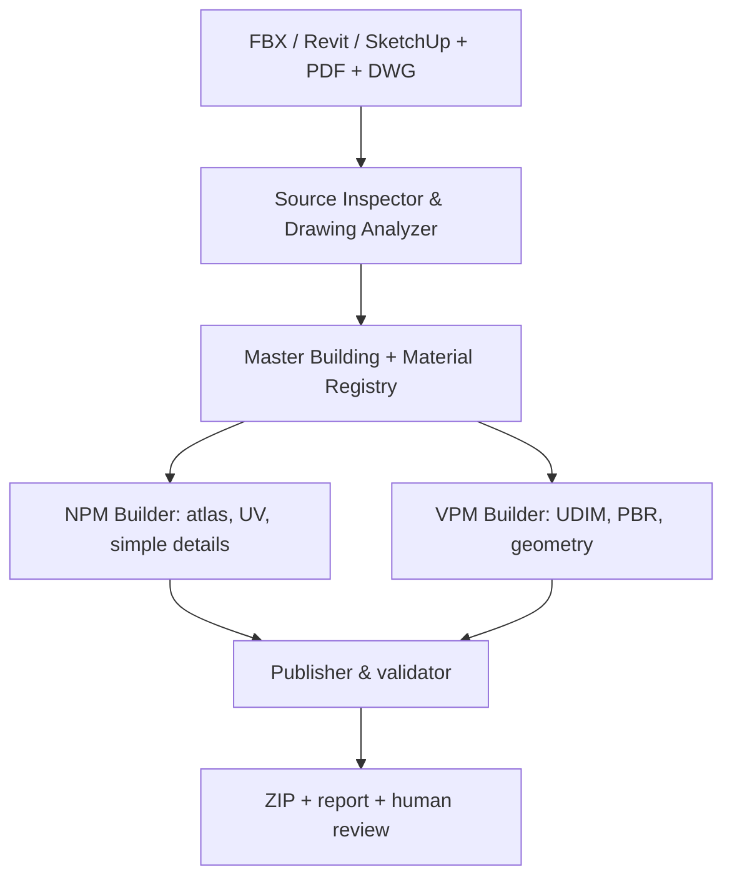

# Digital Twin AI — проектный бриф для разработки

**Версия:** 0.1 · **Дата:** 26 сентября 2026 · **Статус:** передача в разработку, решения из раздела 13 ещё открыты  
**Заказчик/владелец процесса:** Артём, руководитель группы архитектурной 3D-визуализации  
**Цель документа:** дать Codex и инженерным агентам достаточный контекст, чтобы начать проектирование и реализацию единого пайплайна НПМ/ВПМ, не восстанавливая требования из переписки.

> **Инструкция для Codex:** прочитай этот файл и три YAML-профиля целиком. Для каждого нормативного правила при необходимости сверяй страницу приложенного PDF. Не считай обсуждавшиеся гипотезы требованиями распоряжения. При отсутствии производственных образцов сначала создай каркас, контракты данных, небольшие синтетические фикстуры и работающий вертикальный срез; не выдавай имитацию результатов за проверку реального проекта.

## 1. Что передаётся в разработку

В одном каталоге с этим документом должны лежать:

| Файл | Назначение |
|---|---|
| `Rasporyajenies19012026trebovaniya(2).pdf` | Первичный документ, 56 страниц: приложение 1 — НПМ (PDF стр. 1–19), приложение 2 — ВПМ (20–50), приложение 3 — GeoJSON (51–56). SHA-256: `933f6b700c074d0db6b82030fc79d1dbe9db4a0067495ca716e0636acd544222`. |
| `NPM_STANDARD.yaml` | Извлечённые правила низкополигональной сдачи; предварительная версия 0.1. |
| `VPM_STANDARD.yaml` | Извлечённые правила высокополигональной сдачи; предварительная версия 0.1. |
| `DELIVERY_VALIDATOR.yaml` | Перечень проверок, режимов и свидетельств для отчёта; **спецификация**, а не исполняемый валидатор. |
| Этот файл | Цели, архитектура, задачи и открытые решения. |

**Иерархия источников:** утверждённое ТЗ конкретного заказчика/проекта и применимое распоряжение → сам PDF и его приложения → проверенные на PDF YAML-профили → этот бриф → предположения разработчика. Если два источника расходятся, записать расхождение, страницу/пункт и предложенное решение; не исправлять норму незаметно. Весь проект должен хранить идентификатор версии профиля и хеш исходного PDF. Актуальность распоряжения за пределами переданного PDF здесь не проверялась.

### Важно: уточнения относительно раннего обсуждения

1. Для ВПМ документ предписывает **три** обязательные карты: `Diffuse`, `ERM`, `Normal`. `ERM` — R=Emissive, G=Roughness, B=Metallic; отдельная четвёртая карта не является общей нормой. Прозрачность/вырезы при необходимости кодируются в alpha `Diffuse` (стр. 23, 30, 36–37).
2. Правило «Material ID 1 → UDIM 1001, ID 2 → 1002» **не задано**. UDIM — плитки одной UV-развёртки; слоты материалов и номера UDIM — разные сущности. При числе UDIM-карт свыше 100 допускаются дополнительные слоты, всего не более семи (стр. 30–31).
3. Коллизии `UCX_` и GeoJSON явно входят в требования ВПМ (стр. 26, 34, 36–37, 51–55). Не переносить эти правила в НПМ без отдельного задания.
4. НПМ использует PNG-атласы, встроенные в FBX, и обычно один текстурный набор на ОКС (дополнительный набор возможен при эксплуатируемой кровле). ВПМ передаёт PNG отдельно от FBX (стр. 9, 26, 30).
5. Координатные схемы различны: НПМ — геометрия в московской системе координат и проектных высотах (стр. 10); ВПМ — локальная точка отсчёта FBX в нуле, координаты вставки МСК-77 в парном GeoJSON (стр. 32–33, 55). Требуется сверка на реальном образце импорта.

## 2. Цель и критерий успеха

**Цель:** превратить повторяющийся производственный цикл подготовки цифровых двойников/моделей АГР в воспроизводимую систему, где агент организует работу, извлекает сведения из документации, предлагает решения и вызывает специализированные инструменты; детерминированные операции с геометрией, UV, файлами и экспортом выполняются программой; человек утверждает неоднозначные проектные решения и визуальное соответствие.

Успешный результат для первого пилота — на одном реальном ОКС с комплектом исходников и альбомом создать из общей смысловой основы НПМ и ВПМ, получить требуемые архивы, отчёты проверок по каждому профилю и перечень решений человека. Артефакты должны открываться в целевых приложениях и повторно собираться из зафиксированных входов и конфигурации. Цель полной автономности на произвольном FBX/Revit/SketchUp сейчас **не поставлена**.

**Показатели пилота:** время человека по этапам; время полного прогона; доля автоматически пройденных проверок; число ручных исправлений; повторяемость результата после изменения материалов/проёмов; стоимость AI-запросов на одну принятую модель. Стартовые показатели снять на ручном процессе, затем сравнить. Не обещать проценты автоматизации без измерения.

**Область первого этапа:** ОКС, фасад, материал, окно/стекло, крыша и входная группа в объёме, достаточном для одного сквозного примера. Благоустройство, растения, освещение, сложная генерация исходного body, экспорт Revit и все нестандартные объекты — отдельные следующие вертикальные срезы, хотя нормативные проверки для них проектируются заранее.

## 3. Производственный цикл, описанный Артёмом

Это описание текущего желаемого процесса, а не обещание, что каждую операцию можно сразу выполнить автоматически.

| № | Операция | Вход → выход | Предлагаемая автоматизация и участие человека |
|---|---|---|---|
| 1 | Получить FBX, Revit или SketchUp; проверить единицы, геометрию, этажи, проёмы, силуэт и повторения | Исходные модели → отчёт сканера и проектные гипотезы | Адаптеры форматов, геометрический анализ; подтверждение интерпретации модели. |
| 2 | Построить чистый общий `Master Building Body` с осмысленными фасадными поверхностями и удобной сеткой | Анализ → master-геометрия с устойчивыми ID | Процедурные алгоритмы + контроль художника; не делать слепой remesh триангулированного исходника. |
| 3 | Проанализировать PDF-альбомы: материалы, фасады, размеры и типы окон, крышу и первый этаж | PDF → реестр наблюдений со страницами и уверенностью | Извлечение текста/графики и AI-сопоставление; коллизии между листами направлять на проверку. |
| 4 | Согласовать реестр поверхностей и материалов | Наблюдения + master → стабильные Material IDs, назначения граней и источник каждой записи | Агент предлагает; человек утверждает; сохранить отличия между внутренним ID, DCC Material ID/слотом, атласом и UDIM. |
| 5 | Получить ветку НПМ | Master + реестр → облегчённый body, текстурный атлас, UV, оконная графика | Атласный пакер, UV-операции, шаблоны окон, контроль лимитов. |
| 6 | Получить ветку ВПМ | Master + реестр → детальнее body, карты Diffuse/ERM/Normal, UDIM, геометрические окна | Параметрические детали, UV-пакер, генератор карт; соблюдать профиль ВПМ. |
| 7 | Смоделировать крышу, первый этаж, витражи, ограждения и повторяемые элементы | Чертежи + параметры → геометрия/текстуры веток | Библиотека параметрических компонентов по направляющим и шагу; художественная проверка. |
| 8 | Привязать к DWG/СПОЗУ и нулевой отметке | Готовые объекты + исходные координаты → экспортное размещение | Проверяемые трансформации, отдельная логика НПМ и ВПМ; сверка с проектом. |
| 9 | Построить коллизии ВПМ | Модель → выпуклые оболочки UCX | Гибрид генераторов: стены, контуры, парапеты, крыши; визуальная проверка арок, входов, дворов. |
| 10 | Сформировать метаданные, имена, reset, стекло, FBX, PNG и архивы | Сцены → пакеты сдачи | Детерминированный publisher с проверкой имён, UV, карт, GeoJSON и профилей. |
| 11 | Проверить результат и исправить расхождения | Пакеты → машиночитаемый отчёт + визуальный протокол | Валидатор и управляемые итерации; итоговое утверждение ответственным художником. |

Общая геометрическая/семантическая основа **не означает**, что НПМ и ВПМ обязаны иметь одну конечную топологию или UV. Изменение фасадного материала должно пересобирать зависимые карты и публикации; изменение этажности — также body, окна, коллизии и координатную проверку.

## 4. Принципы архитектуры

1. **Стандарты как данные.** Правила сдачи и проектные исключения конфигурируются профилями с версиями; проверка не прячет константы в DCC-скриптах.
2. **Один смысловой слой, две выходные ветки.** `Master Building` хранит элементы, поверхность, этаж, проём, материал, источник и связь с проектом. НПМ/ВПМ — производные представления.
3. **Детерминированный исполнитель.** Codex составляет план и обрабатывает неясность; скрипты/адаптеры выполняют преобразования и записывают отчёты. AI не передаёт миллионы вершин через контекст.
4. **Явные контракты между приложениями.** Версионированные JSON/JSON Schema/Pydantic-модели для реестра, окна, геопривязки, задания на сборку и отчёта. Большая геометрия живёт в файлах, не в JSON.
5. **След от источника к результату.** Каждое решение по материалу/размеру содержит лист PDF, область или идентификатор элемента исходной модели, статус утверждения. Неуверенное измерение по пикселям не выдаётся за проектный размер.
6. **Проверки по фактическому экспорту.** После сборки повторно прочитать FBX/PNG/GeoJSON из ZIP; проверки только внутри рабочей сцены недостаточны.
7. **Идемпотентность и частичная пересборка.** Одинаковые входы/версии правил дают одинаковую смысловую структуру; кэш по хешу входов и зависимостей. Не перезаписывать утверждённые ручные решения при новом прогоне.
8. **Разделение рабочего и экспортного размещения.** Моделировать около локального нуля, хранить трансформацию и исходную геопривязку, применять правила соответствующего профиля при публикации.
9. **Валидация не подменяет визуальное утверждение.** Совпадение с фасадами, пропорции окон, размещение материальных зон и качество коллизий требуют overlay/скриншотов и подписи человека.

### Логический поток



### Слой данных (предложение)

- `ProjectManifest`: project ID, адрес и его нормализованная форма, версии правил, набор входов с хешами, версии приложений, принятые допущения.
- `SourceElement`: исходный файл/объект/IFC или Revit ID при наличии, роль, этаж, габариты, связь с master.
- `BuildingElement`: устойчивый ID, тип (`facade`, `opening`, `roof`, `ground_floor`, `glass`, `railing`...), геометрическая ссылка, этаж и зависимые производные.
- `MaterialRegistryEntry`: устойчивый `MAT_xxx`, наименование, физический тип, цвет/фактура, PDF лист/фрагмент, поверхности, статус `proposed/approved/conflict`, NPM atlas region, VPM карта/UDIM и отдельные DCC material slots. Не выводить `UDIM` из номера `MAT` по умолчанию.
- `WindowType`: стабильный ID, проверенные ширина/высота, членение, профиль, фасад, исходный размер или координаты модели, метод получения размера, статус проверки. Рендер НПМ и геометрия ВПМ используют один набор параметров.
- `Placement`: система координат источника, единицы, проектная нулевая отметка, матрица в локальную систему и обратно, DWG/СПОЗУ-основание, точка вставки GeoJSON при ВПМ.
- `BuildJob`: цель, профиль, входы, версии инструментов, зависимости, выходы, статусы ручных ворот.
- `ValidationFinding`: ID правила, фактическое значение, ожидаемое, файл/объект, страница PDF, статус, доказательство, предложенное исправление.

Все схемы версионировать; миграции обязательны при изменении полей. Внутренние `MAT_xxx` и `WIN_xxx` — предлагаемые идентификаторы системы, **не нормативные имена сдачи**.

## 5. Компоненты и границы ответственности

| Компонент | Делает | Не должен решать самостоятельно |
|---|---|---|
| `source-inspector` | Импортный инвентарь, единицы, bounding boxes, этажи, повторения, диагностика меша | Какой спорный фасад соответствует альбому. |
| `drawing-analyzer` | Индексация PDF, таблицы, графика, размеры, листы, кандидаты материалов и окон | Размер только по числу пикселей без масштаба/размерной привязки. |
| `master-building` | Стабильные ID и связи исходника с производными объектами; ручные правки | Самовольно менять утверждённую топологию. |
| `material-registry` | Утверждение соответствий поверхности → материал → текстуры и источники | Приравнивать слот материала к UDIM. |
| `npm-builder` | Чистая облегчённая сетка, атлас, UV, текстурные окна | Добавлять UCX/GeoJSON в официальный пакет без отдельного ТЗ. |
| `vpm-builder` | UDIM, Diffuse/ERM/Normal, отдельные окна/стекло | Подменять ERM картой IRM. |
| `detail-generators` | Окна, парапеты, ограждения, рейки по геометрическим параметрам | Изобретать проектные параметры без источника. |
| `collision-generator` | Выпуклые замкнутые оболочки UCX и отчёт покрытия | Закрывать единым hull проёмы/арки/дворы. |
| `placement` | Привязка и обратимые матрицы НПМ/ВПМ | Смешивать московские координаты с локальными единицами FBX. |
| `publisher` | Экспорт FBX 7.4 binary, карты, GeoJSON, имена, ZIP | Обходить проверки или тихо переименовывать непонятные адреса. |
| `validator` | Правила из профилей, report.json/HTML, ссылки на объект и источник | Объявлять художественное соответствие автоматически доказанным. |
| `orchestrator` | Зависимости задач, запуск DCC, кэш, ручные ворота, AI-подсказки | Менять утверждённые данные без протокола изменений. |

**Технологическая гипотеза:** Python для схем, CLI, PDF и отчётов; 3ds Max Python/MAXScript для операций в основной производственной среде; Blender Python как отдельный адаптер/исполнитель UV и пакетных экспериментов; Revit API для будущего извлечения BIM-семантики; DWG читать через лицензированный имеющийся CAD-инструмент либо согласованный конвертер. Не предполагать, что библиотека для DXF напрямую читает DWG. Зафиксировать реально доступные версии 3ds Max (у команды есть 2024/2025), Blender, Revit, FBX SDK и ОС прежде, чем привязывать ядро к конкретному API. На начальном этапе допускается CLI, который запускает адаптер на Windows-машине; не проектировать обязательное управление чужим GUI как базовый интерфейс.

## 6. Предлагаемая структура Git-репозитория

```text
digital-twin-ai/
├── AGENTS.md                    # краткие обязательные правила и маршрутизация
├── README.md                    # запуск и обзор, ссылка на этот бриф
├── docs/
│   ├── DIGITAL_TWIN_AI_PROJECT_BRIEF.md
│   ├── decisions/              # ADR-0001..., спорные решения и источники
│   ├── workflow/               # карты НПМ/ВПМ, ручные ворота
│   └── examples/               # обезличенные примеры, если разрешено
├── standards/
│   ├── source/                 # версия оригинального PDF и контрольная сумма
│   ├── NPM_STANDARD.yaml
│   ├── VPM_STANDARD.yaml
│   ├── DELIVERY_VALIDATOR.yaml
│   └── project_overrides/      # отдельное ТЗ проекта с владельцем/версией
├── schemas/                    # JSON Schema/Pydantic контракты и миграции
├── src/dt_ai/
│   ├── core/                   # manifest, IDs, dependency graph, profiles
│   ├── drawing/                # PDF → наблюдения с источниками
│   ├── geometry/               # анализ, master, генераторы
│   ├── materials/              # registry, texture processing, atlas/UDIM
│   ├── placement/              # координаты и высоты
│   ├── publish/                # export, packaging, GeoJSON
│   ├── validate/               # машинные проверки и evidence
│   └── cli/                    # dt inspect|registry|build|validate|publish
├── adapters/
│   ├── max/                    # MaxScript/Python и batch runner
│   ├── blender/                # bpy, headless runner
│   ├── revit/                  # будущий адаптер API
│   └── cad/                    # DWG/СПОЗУ: согласованный backend
├── tests/
│   ├── fixtures/               # маленькие воспроизводимые mesh/PNG/GeoJSON
│   ├── contracts/              # схемы и инварианты
│   ├── integration/            # экспорт ↔ повторный импорт
│   └── regression/             # реальные кейсы после разрешения на хранение
├── jobs/                       # задания/STATE.md; тяжёлые входы вне Git
├── tools/                      # разработка, миграции, отчёты
└── .github/workflows/          # быстрые независимые от DCC проверки
```

`AGENTS.md` должен быть коротким маршрутизатором: ссылка на профили и бриф, правила сохранения источников и изменений, запрет молчаливого изменения нормативных правил, команда проверки. Не копировать в него все 56 страниц и не генерировать туда журнал каждой задачи. Производственные навыки/Skills добавлять по мере появления рабочего инструмента, контракта и проверенного примера, а не создавать 12 пустых ролей сразу.

**Git и параллельная работа:** защищённая ветка `main` для проверенных изменений; отдельный worktree/ветка на компонент или задачу. Общие контракты менять через ADR/PR, прежде чем разные ветки начнут полагаться на несовместимые версии. В `jobs/<ID>/STATE.md` хранить цель, base commit, профиль, входные хеши, выполненные проверки, артефакты и следующий шаг; не хранить огромные FBX/PNG в обычном Git. Codex-агенты могут работать параллельно после фиксации контрактов, но интеграция и проверка общего вертикального среза остаются отдельной задачей.

## 7. Разделение AI и обычного кода

| Работа | Основной исполнитель | Почему |
|---|---|---|
| Извлечь кандидатов материалов/окон из неоднородных PDF | AI + PDF parser, затем человек | Расположение таблиц, фасады и легенды неодинаковы. |
| Сопоставить повторяющиеся элементы и выявить спорное место | Геометрический алгоритм + AI-объяснение | Расчёты воспроизводимы, интерпретация иногда неоднозначна. |
| Распределить утверждённые UV и запаковать атлас | DCC-скрипт/пакер | Координаты и ограничения проверяемы. |
| Упаковать ERM и конвертировать normal в DirectX | Пиксельный код | Каналы и значения нельзя доверять текстовой генерации. |
| Создать окна/ограждения по размерам и шагу | Параметрический генератор | Геометрия должна повторно собираться после изменения параметров. |
| Привязать координаты, назвать, экспортировать, проверить JSON | Детерминированный код | Нужны точность, идемпотентность и проверка файлов. |
| Разрешить противоречие между альбомом и исходником | Ответственный специалист с отчётом AI | Проектное решение не следует угадывать. |

## 8. Порядок разработки и конкретные задачи

### Этап 0. Репозиторий и контракты (сначала)

| ID | Задача | Приёмка |
|---|---|---|
| DT-001 | Создать репозиторий по разделу 6, README, минимальный AGENTS.md, окружение и CLI-заглушку. | Чистый clone → установка → `dt --help`; CI проверяет YAML/схемы. |
| DT-002 | Сверить три YAML с PDF, записать таблицу правило → пункт/страница → способ проверки → спорный статус; ADR на противоречия. | Ни одно жёсткое правило валидатора не существует без ссылки на страницу или отдельное ТЗ. |
| DT-003 | Описать и проверить схемы `ProjectManifest`, `MaterialRegistry`, `WindowType`, `Placement`, `BuildJob`, `ValidationReport`; подготовить маленькие фикстуры. | Валидные/невалидные примеры проходят схемы; ID устойчивы между прогонами. |

### Этап 1. Первый вертикальный срез: документ → материалы → два выхода

Для пилота допускается **ручной, но зафиксированный master body**: это снимает исследовательскую задачу произвольной реконструкции с критического пути. Вход — альбом PDF, один FBX и утверждённая карта фасадов/окон. Выход — материал-реестр с ссылками на листы, один НПМ-атлас и один комплект ВПМ-карт/UDIM на подготовленной геометрии. Это первая полноценная проверка идеи общего смыслового слоя.

| ID | Зависит от | Задача | Приёмка |
|---|---|---|---|
| DT-010 | 003 | Индексатор PDF: листы, текст, изображения, области и ссылочный идентификатор. | Каждое извлечённое наблюдение можно открыть на указанном листе; нечитаемые сканы помечены. |
| DT-011 | 010 | UI/файл реестра материалов с `proposed/approved/conflict`, связь поверхность ↔ источник ↔ материал. | Повторный прогон не затирает approved; конфликт виден человеку. |
| DT-012 | 003,011 | НПМ: атлас и UV по утверждённой карте на готовом body. | PNG и FBX соответствуют NPM-профилю; проверены несколько островов, padding и embedding после повторного импорта. |
| DT-013 | 003,011 | ВПМ: Diffuse/ERM/Normal, DirectX normal, UDIM и раскладка. | Пары карт существуют только для используемых плиток; ERM каналы и UV проверены пиксельным тестом и повторным импортом. |
| DT-014 | 012,013 | Две ветки из одного registry и отчёт изменившихся зависимостей. | Замена одного утверждённого материала пересобирает нужные выходы и не меняет соседние. |

### Этап 2. Публикация и валидация

| ID | Зависит от | Задача | Приёмка |
|---|---|---|---|
| DT-020 | 002,003 | ZIP/PNG/имена/GeoJSON проверки V001,V006,V007,V011,V012. | На небольших намеренно неправильных фикстурах каждый класс ошибки выдаёт объект, фактическое значение и страницу PDF. |
| DT-021 | 003,012,013 | FBX инспектор V002–V005,V008–V009. | Считает реальные треугольники после экспорта, читает material slots и UV, проверяет применённые трансформации. |
| DT-022 | 020,021 | Publisher НПМ/ВПМ и повторная проверка готового ZIP. | Один CLI-вызов даёт пакеты, report.json и человекочитаемый отчёт; пустой/битый архив не проходит. |
| DT-023 | 003,022 | Позиционирование и GeoJSON с DWG/СПОЗУ для одного пилотного объекта. | Сравнение плановой точки, высоты и orientation на контрольной сцене; профили НПМ/ВПМ не смешиваются. |

### Этап 3. Геометрия и параметрические детали

| ID | Задача | Приёмка |
|---|---|---|
| DT-030 | Сканер FBX: этажи, проёмы, основные плоскости, повторяемые фасадные модули; отчёт для человека. | На контрольной модели выделены реальные объекты и спорные случаи без скрытого «уверенного» домысла. |
| DT-031 | Параметрический master body по подтверждённым контурам/отметкам. | Контур/проёмы совпадают с источником по заданному допуску; перестройка не ломает стабильные ID. |
| DT-032 | Библиотека окон: один тип → НПМ-изображение и ВПМ-геометрия; затем крыша/первый этаж/ограждения. | На образце совпадают размеры, секции и места установки; изменения параметров отражаются в обеих ветках. |
| DT-033 | Гибридный генератор UCX для ВПМ и overlay проверки. | Выпуклые замкнутые непересекающиеся оболочки; арка/двор остаются проходимыми; V010 и V016 дают evidence. |

### Этап 4. Форматы и масштабирование

Revit API и SketchUp-адаптеры; благоустройство; растительность; освещение; пакетные задания; кэш и частичная пересборка; система метрик. Каждое направление получает маленький контрольный проект и отдельный контракт. Добавлять агента или Skill только после рабочего прототипа соответствующего инструмента.

**Приоритет при ограниченном времени:** DT-001–003 → 010–014 → 020–023. DT-030–033 не должны задерживать первый пилот с вручную утверждённым body. При наличии готовых внутренних скриптов команды сначала инвентаризировать их и оборачивать существующий функционал, а не переписывать без оснований.

## 9. Интерфейс заданий, ручные ворота и отчёт

Предлагаемая CLI-поверхность (имена уточнить при реализации):

```bash
dt inspect --manifest jobs/DT-0042/project.yaml
dt registry propose --job DT-0042
dt registry approve --job DT-0042 --decision decisions/materials.yaml
dt build npm --job DT-0042
dt build vpm --job DT-0042
dt validate --job DT-0042 --profile vpm --archive exports/SM_Example.zip
dt publish --job DT-0042 --profile npm
```

**Ручные ворота:** `sources_confirmed` (система координат/единицы), `materials_approved`, `master_geometry_approved`, `facade_and_windows_approved`, `placement_approved`, `collision_review_approved` для ВПМ, `delivery_approved`. Каждый gate записывает автора, дату, версии входов и комментарий; смена зависимого входа возвращает нужный gate в `review_required`.

**Отчёт проверки:** `pass/fail/review/not_applicable/not_run`, правило и профиль, ожидаемое и измеренное значение, путь внутри архива, объект/полигон/UV плитка при необходимости, ссылка на страницу PDF или отдельное ТЗ, скриншот/оверлей для визуальных проверок. `passed=true` только при нуле блокирующих ошибок, выполненных обязательных машинных проверках и подтверждённых ручных воротах. Сами YAML-профили сейчас ещё не являются исполняемыми проверками.

## 10. Реальный пилот и приёмочные данные

Для доведения системы до практического результата команде понадобится один проект, который можно использовать для разработки:

- исходный FBX/модель и сведения о единицах; по возможности Revit/SketchUp как дополнительные источники;
- PDF-альбом фасадов с ведомостью материалов и размерами окон;
- DWG/СПОЗУ с точкой вставки, системой координат и проектной нулевой отметкой;
- один выполненный вручную или одобренный образец НПМ и ВПМ либо хотя бы контрольные скриншоты/ожидаемые пакеты;
- образец принимаемого GeoJSON, правила именования адреса и любое дополнительное ТЗ заказчика;
- право хранить эти материалы в рабочем репозитории или отдельном защищённом хранилище.

Если комплект неполон, Codex продолжает с синтетическими фикстурами и фиксирует, какие пункты пока невозможно подтвердить на реальном проекте. Не заменять источники вымышленными измерениями.

## 11. Риски реализации и способы проверки

| Риск | Как уменьшить |
|---|---|
| OCR сканов путает символы, числа, знаки формулы и имена GeoJSON. | Проверить глазами нормативные места и таблицы; в артефактах хранить страницу и фрагмент. Например, формула плотности на стр. 32 — деление, а не знак `+`. |
| Произвольный импортированный FBX невозможно надёжно преобразовать в чистые квады одним общим алгоритмом. | Первый пилот с ручным master body, затем набор распознаваемых классов зданий и явный fallback на художника. |
| Скрипт в 3ds Max и Blender выдаёт разный FBX/материал. | Контрактные образцы, повторный импорт и сравнение экспортных инвариантов; версионировать адаптеры и приложения. |
| DWG использует иные единицы, систему координат или UCS; большой offset теряет точность в DCC. | Явные матрицы, локальное рабочее размещение, контрольные точки, отдельный плановый overlay и GeoJSON. |
| UV-острова и текстуры проходят формальные правила, но фасад выглядит неверно. | Рендеры контрольных ракурсов, наложение на утверждённые фасады и ручное утверждение. |
| Collisions формально convex, но перекрывают вход или арку. | Overlay + тест проходов/областей; генератор разбивает объём по функциональным пустотам. |
| Пересборка стирает ручные решения. | Отдельный слой утверждённых overrides и проверка инвалидации по зависимости, не править их генератором. |
| В PDF есть двусмысленности. | Правило со статусом `needs_decision`, ADR и безопасный `review`, а не ложный `pass/fail`. |

## 12. Известные неоднозначности перед кодированием жёстких правил

1. **GeoJSON обязательность полей.** Стр. 27 требует все значения для ОКС, кроме `other`; таблица на стр. 53–54 допускает отсутствие `FNO_code`/`act_AGR`, когда информации нет. Codex должен сверить оригинал и предложить режим проверки; без решения — `review`, а не вымышленное значение.
2. **Предел коллизий ВПМ.** Стр. 36–37: для модели меньше 50 000 треугольников — 15 000; иначе 5% с округлением вверх, но далее отдельно упомянуты «до 100 000» дополнительных треугольников. Зафиксировать приоритет, особенно для большого благоустройства.
3. **Рекомендуемый зазор между коллизиями:** в тексте указан диапазон 0,02–1 см (стр. 36). Он помечен как рекомендация; не делать блокирующим минимумом без проверки смысла и испытания импорта.
4. **Величина файла ZIP:** «МБ/ГБ» в тексте не определяет однозначно десятичные или двоичные байты. Порог near-boundary помечать для ручной проверки, пока заказчик не уточнит.
5. **Нумерация UDIM:** рисунок на стр. 39 содержит очевидную опечатку в одной клетке верхних рядов; текст требует последовательные 1001–1100. Использовать текстовое правило и обычную сетку 10×10, записав причину.
6. **Смысл поворота и pivot ВПМ:** сопоставить стр. 32–33 и реальный экспорт 3ds Max/Blender: локальный origin FBX, zero rotation, общие pivot мешей и точка проекта. Проверить экспериментом, прежде чем делать массовый reset.
7. **Альфа и стекло:** ВПМ допускает alpha Diffuse для отверстий/вырезов, но отдельному `MainGlass` запрещает текстуры; НПМ alpha текстур запрещён, но отдельная карта opacity допустима при соответствующих элементах. Протестировать эти разные ветки.

## 13. Вопросы, которые Codex должен проработать, и решения команды

### Codex может исследовать и предложить ADR

- Какие операции рациональнее исполнять в 3ds Max batch, а какие в Blender headless, если у команды оба приложения? Провести маленький экспорт/import benchmark с одинаковой геометрией и материалами.
- Как хранить устойчивую идентичность поверхностей после перестроения body? Предложить правило ID, map старого/нового и отчёт о потерянных соответствиях.
- Каким алгоритмом измерять плотность texel для неосевых и искривлённых фасадов, не нарушая норму 512–1706 px/m?
- Как разделять UCX на выпуклые части с учётом проходов, крыш, первых этажей и лимита треугольников? Сравнить несколько методов на контрольной модели.
- Как выполнять надёжную координатную привязку к DWG/СПОЗУ в реально доступной инструментальной цепочке?
- Где проходить ручные ворота: редактируемый YAML/JSON, простая локальная панель или DCC-диалог? Начать с минимального, проверяемого способа.

### Требуется выбор Артёма/команды или подтверждение заказчика

- Какая ОС и версии 3ds Max/Blender/Revit реально используются на машинах исполнителей; где будет запускаться DCC runner и есть ли разрешённый batch-доступ?
- Какой конкретный проект можно использовать как пилот, какие у него исходники и ожидаемые готовые результаты?
- Какая система/версия DWG является источником правды, какая нулевая отметка, и есть ли эталон точки вставки?
- Требует ли договор **дополнительно** коллизии и/или JSON для НПМ, либо это смешение требований двух профилей?
- Какие художественные упрощения допустимы для фасадов, окон, первого этажа и крыши? Кто ставит финальную отметку `approved`?
- Есть ли действующее дополнительное ТЗ, которое меняет карту текстур, именование, ограничения и схему GeoJSON из приложенного PDF?

Codex не должен останавливать DT-001–003 и фикстуры из-за этих ответов; зависимые операции помечать `blocked_on_project_input` и продолжать независимую работу.

## 14. Инструкция для начала нового чата Codex

Скопировать текст ниже вместе с этим файлом и четырьмя приложениями в рабочий каталог проекта:

> Ты инженерный агент проекта Digital Twin AI. Прочитай `DIGITAL_TWIN_AI_PROJECT_BRIEF.md`, `NPM_STANDARD.yaml`, `VPM_STANDARD.yaml`, `DELIVERY_VALIDATOR.yaml` и при споре оригинальный PDF. Начни с этапа 0: создай структуру репозитория, краткий AGENTS.md, схемы контрактов и трассировочную таблицу нормативных правил с точными страницами. Затем реализуй первый маленький вертикальный срез на синтетическом здании: утверждённый Material Registry → НПМ-атлас → ВПМ Diffuse/ERM/Normal + UDIM → повторная проверка файлов. Используй настоящие DCC-адаптеры только если приложения доступны; иначе сделай независимое ядро и тестовые фикстуры и явно обозначь непроверенные интеграции. Не принимай новых нормативных правил по догадке; оформляй спорное как ADR или `review`. В конце каждого этапа сохраняй STATE.md с commit, результатом проверок и следующей задачей. Показывай конкретные артефакты и ограничения.

**Первый проверяемый результат нового проекта:** репозиторий с контрактами и трассировкой норм, запуском `dt --help`, одним небольшим входным manifest, серией отрицательных фикстур валидатора и отчётом, какие реальные входы нужны для пилота. Затем двигаться по задачам DT-010–014, не строя весь генератор здания одним скачком.

---

### История изменений

- **0.1 (26.09.2026):** первичный бриф по устному описанию процесса НПМ/ВПМ и трём извлечённым YAML-профилям; код и проверки реального проекта ещё не созданы.
