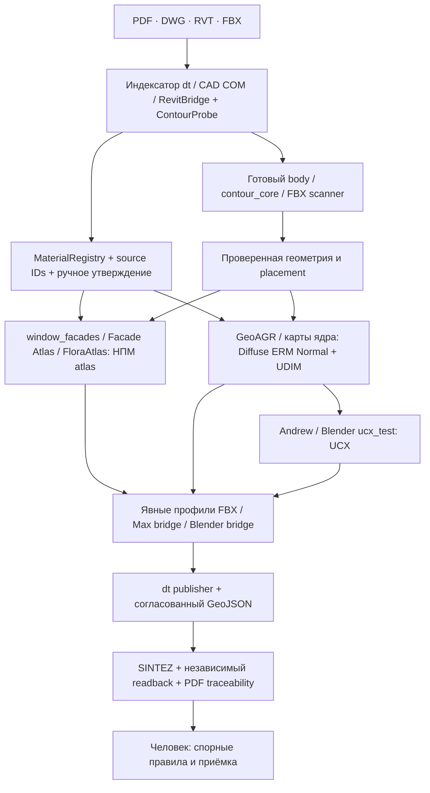

# Карта существующих инструментов по этапам НПМ/ВПМ

Карта — предложение интеграции. Работоспособность каждой стрелки определяется
статусом записи [каталога](catalog.html), не самим наличием схемы.

- **DT-010–011, источники и материалы:** `GEN-01/02/04`, `RVT-03/04`, `CAD-01/02`.
  Переиспользуем извлечение, удобный выбор области и preview; ядро сохраняет
  approved/conflict. Цвет/яркость сами по себе не доказывают материал.
- **DT-012, НПМ:** `BL-09`, `GEN-01/02/03`, `MAX-01/03/07/14`.
  Первым адаптировать сохранение UV/source IDs и atlas metadata. Flora opacity,
  стекло и padding проверять по профилю, не по значениям GUI по умолчанию.
- **DT-013, ВПМ:** `MAX-01/08/10`, `GEN-04`, `BL-01`, `GEN-08`.
  Генерация карт, preview node wiring и validation — разные операции. `GEN-05`
  ERM→ORM вынесен за нормативный exporter.
- **DT-014, зависимости:** существующее ядро проекта. Любой внешний output
  содержит input hashes и stable IDs. Инструменты с неявными глобальными/GUI
  настройками сначала получают явный job snapshot.
- **DT-020–022, проверка и сдача:** `BL-01/05`, `MAX-14/15/16/26`, `GEN-07/08`.
  Сначала использовать измерения и native findings; затем сопоставить с PDF.
  GeoAGR/TS Tools/BMAX не объявлять publisher без readback и проверки masks.
- **DT-023, размещение:** `CAD-01/02/03`, `MAX-01/10/14/24`, `RVT-01/03`.
  Сохранять исходные units/CRS/offsets. Scene московских границ — контрольная
  подложка, не источник вымышленных координат.
- **DT-030–032, body/окна:** `RVT-03/04`, `MAX-11/19/21/23/25`, `GEN-01`.
  Готовый WindowType должен иметь проверяемые размеры/контур и происхождение,
  а не только dummy по имени или bbox.
- **DT-033, UCX:** `BL-08`, `MAX-09/12/17/22`, `BL-01`.
  Генератор, корректор, validator и оценка coverage раздельны. Runtime движка
  пока не проверен. Для спорных UCX-лимитов сохраняется ADR-0002, PDF36–37.

Машиночитаемая версия карты: [stage-map.json](stage-map.json).
