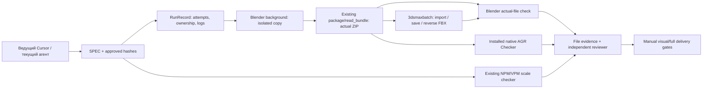

# Реализация и исполненный пилот — 01.10.2026

Локальная интеграция реализована на checkout `d7ecdfd` с сохранением чужих
изменений. Коммит, push и изменение GitHub не выполнялись. Итоговый запуск:
`jobs/ORCH-OBR22-NPM/runs/pilot-20261001-004/attempt-001/`.
Обр22: реальный принятый НПМ v012 одного этажа, ВПМ v011 только reference.
Полная нормативная сдача и визуальная приёмка нового переноса не подтверждены.

## Подключение и переиспользование



Использованы существующие `AdapterReport`, упаковщик `publish.bundle`, сохранённые
approved-версии, `check_npm_vpm_scale.py`, Blender4.4 и FBX add-on,
Max2024.2.5/FBX и установленный AGR Checker1.6.1. Новых MCP/платформы агентов нет.
Max и SketchUp MCP отвечают; открытая Max-сцена другого задания остаётся с7
объектами. Пилот использует самостоятельные background/batch процессы.

Добавлены `src/dt_ai/core/run_record.py`, два snapshot wrapper и общий helper,
`tools/run_profile_pilot.py`, `tools/run_profile_checks.py`, native AGR/Max
wrapper и render comparator. `.cursor/agents/dt-verifier.md` наследует модель
и работает read-only; TASK_CONTEXT/AGENT_WORKFLOW содержат маршрут процесса.
Native Cursor subagent discovery подтверждён отдельным CLI запуском004:
taskToolCall custom dt-verifier completed success, exit0. Настройка и команда:
[CURSOR_CLI.md](CURSOR_CLI.md). Пилот DCC при этом не повторялся.

## Команды

Из корня проекта, для нового запуска выбирать новое имя:

```powershell
.venv/Scripts/python.exe tools/run_profile_pilot.py --blender "C:/Program Files/Blender Foundation/Blender 4.4/blender.exe" --run-id pilot-20261001-004
.venv/Scripts/python.exe tools/run_profile_pilot.py --blender "C:/Program Files/Blender Foundation/Blender 4.4/blender.exe" --resume jobs/ORCH-OBR22-NPM/runs/pilot-20261001-004
.venv/Scripts/python.exe tools/run_profile_checks.py --run jobs/ORCH-OBR22-NPM/runs/pilot-20261001-004 --review-id native-003 --blender "C:/Program Files/Blender Foundation/Blender 4.4/blender.exe" --agr-addon "C:/Users/artsafro/AppData/Roaming/Blender Foundation/Blender/4.4/extensions/user_default/sintez_agr_checker" --max-batch "C:/Program Files/Autodesk/3ds Max 2024/3dsmaxbatch.exe"
```

Первый запуск exit0,8.75с; resume exit0,1.83с, одна attempt и четыре verified
стадии без повторного DCC/экспорта. `--resume ... --new-attempt` создаёт новую
папку, сохраняя failed/partial evidence; изменившиеся inputs/code требуют нового
run. Две одинаковые классифицированные причины останавливают RunRecord.
Supplemental review всегда создаёт новую папку; его resume пока не реализован.
Output directories имеют эксклюзивные locks; атомарный JSON проверяется после
записи; Windows timeout завершает собственное дерево процессов по точному PID.
При невозможности cleanup run останавливается. В sandbox taskkill запрещён;
native timeout test выполнен с разрешённой эскалацией.

## Фактическая проверка

| Проверка | Результат и свидетельство внутри attempt |
|---|---|
| Approved inputs |7/7 SHA сохранены; input-manifest.json |
| Native editable файл | working-copy.blend повторно открыт; native_source.objects полностью совпали с preflight, включая polygon/UV/material/instance данные; editable-readback/source-snapshot.json |
| Экспорт |46 meshes,2603 editable quads →5206 FBX triangles; FBX7400 binary; export/export-manifest.json |
| ZIP | фактические bytes членов повторно прочитаны и импортированы; package-readback.json |
| Blender FBX | геометрия, winding, все UV channels, ordered slots/Material indices и SHA embedded PNG совпали; actual-file-readback.json |
| Max | isolated native import/save/re-export exit0; reviews/native-003/max-batch/max-native.json |
| Обратный Max FBX | Blender native readback: per-object surface/UV/winding/indices/ordered slots/atlas SHA совпали; max-batch/blender-reverse-readback.json |
| Масштаб НПМ/ВПМ |455 грани, phase error4.073e-7м; scale0.99999508–1.00000251; VPM и4карты сохранены; scale-snapshot/npm_v012/npm-vpm-scale-qa.json |
| Визуальное сравнение |4 native PNG, одинаковые front/oblique камеры; агент просмотрел oblique пару; пользовательская приёмка pending |
| AGR |53 результатов:2 pass,9 fail,42 review; internal errors0; input unchanged; agr-native/agr-diagnostic.json |

Численная ошибка координат Blender FBX ≤3.815e-6м (~0.0038мм), UV0.
Это serialization comparison по бюджету существующего comparator, не новая норма.
File UnitScaleFactor не проверен; physical scale проверяется world coordinates.
Розовые finish_id0 торцы сохранены как исходная незакрытая отделка.
Generic finish_id и восстановление instance ownership через FBX не сертифицированы.
Повторное открытие сохранённого `.max` отдельно не выполнено; actual reverse FBX
проверен. Новые точные вырожденные/дублированные triangles не появились; полнота
проверки всех overlaps/intersections/manual gates не заявляется.

AGR замечания: имена FBX/объектов/материалов/текстур,21 трансформация, состав
Ground/ОКС, количество материалов и наличие требуемых карт. Технический архив
компонента намеренно не содержит полный состав сдачи. Raw findings сохранены;
нулевое покрытие native green не выдано за pass. Нормы/модель не ослаблялись ради
зелёного отчёта. Supplemental command exit1 отражает9 native fail групп.
Итог: **component transfer technical checks passed; delivery_passed=false**.

## QA и ревью

- pytest135 passed,1 skipped,1 warning,exit0; basetemp `tmp/orchestration-final-pytest-02`.
- profiles3/source hash/traceability OK; schemas8 OK.
- SYNTH-001 background build/readback exit0 в `tmp/orchestration-final-synth`:
  development_checks_passed=true,delivery_passed=false. Synthetic отдельно от real pilot.
-13 RunRecord tests: cache identity, hash invalidation, locking, timeout tree,
  stale/partial outputs, повторение причин и atomic verification.
-6 comparator fixtures ловят порчу UV, indices, winding и missing surface.
  [Неверный тестовый критерий](fixture-test-criterion.json) явно synthetic;
  исправлена проверка quad→tri surface, production критерии не изменены.
- [Независимое ревью](REVIEW.md), [native wrappers review](NATIVE_REVIEW.md).

## Дальнейшая интеграция

1. Внешний Cursor CLI настроен и проверен после явного разрешения контекста и
   Windows allowlist/--trust: запуск004 exit0,custom dt-verifier completed success.
   Результат и transcript — job cli-runs/cursor-20261001-004. Shell/DCC/MCP/write
   вызовов не было. Дальнейшие узкие проверки запускаются по CURSOR_CLI.md.
2. Принять или отклонить визуальное сравнение нового transfer. Принятие исходной
   модели не переносится автоматически на новый экспорт.
3. Полную OKS сдачу оформить отдельным job: naming, full composition, карты,
   трансформации, placement/geojson, topology/manual AGR gates. Ground и VPM build
   остаются отдельными профилями; НПМ-ОКС не получает Ground TD.
4. После проверки на втором объекте решать, какие wrappers становятся общими
   adapters. Сейчас runner намеренно ограничен реальным OBR22 component pilot.

Все прежние failed runs/logs сохранены. Ранний003 review устарел: часть кода
изменялась во время его запуска; final004/native-003 имеет protected_inputs=pass.
Исторический evidence.json хранит первоначальный аудит, актуальное компактное
свидетельство — execution-evidence.json.


