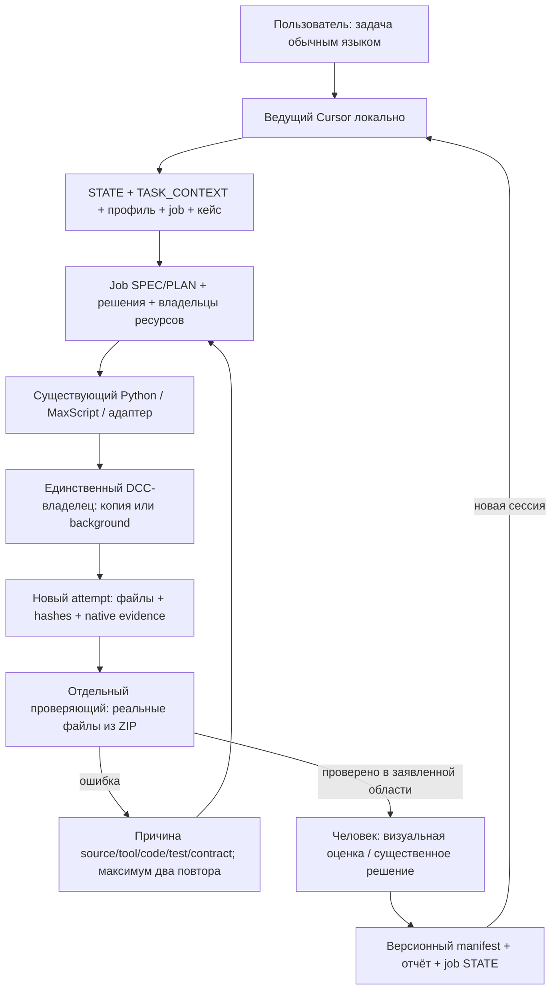

# Локальная оркестрация NPM/VPM: аудит и проект подключения

01.10.2026. Статус: **локальная интеграция реализована; реальный пилот передачи выполнен**.
Актуальный результат, команды и ограничения: [EXECUTION.md](EXECUTION.md).
Ниже сохранены аудит и исходное обоснование решения; сведения об отключённых
соединениях и 116 тестах относятся к первоначальному обследованию.
Область: локальный checkout `C:/Users/artsafro/.AGR_Project`, HEAD `d7ecdfd`;
есть чужие незакоммиченные изменения и локальные/untracked инструменты.
Это не аудит удалённого main. GitHub/CI/PR не изменялись; PR18 отложен.
Основание: приложенное пользователем задание, AGENTS.md, TASK_CONTEXT,
AGENT_WORKFLOW, бриф и три профиля прочитаны; см. [свидетельства](evidence.json).

## Решение

Использовать штатного ведущего агента Cursor и отдельного проверяющего с
наследованием модели. Существующие Python/MAXScript/DCC-инструменты остаются
исполнителями. Добавить протокол run/attempt, назначение владельца ресурсов и
тонкие файловые обёртки для реально отсутствующих операций. Собственная
платформа агентов, новый MCP, облачный DCC и дублирующий Workbench не нужны.

Первый пилот: сохранённый типовой этаж **Обр22, НПМ v012** → отдельная рабочая
копия → FBX/PNG и технический ZIP → импорт фактического FBX из ZIP → сравнение
геометрии/UV/атласа → независимый отчёт → ручная оценка. Это пилот передачи
компонента, а не полная нормативная сдача здания. [Подробный проект](PILOT.md).

## Что проверено сегодня

- `.venv/Scripts/python.exe -m pytest -q --basetemp tmp/orchestration-audit-20261001/pytest`:
  116 passed, 1 skipped, 1 warning, exit0. Предварительный запуск дал30 setup errors
  из-за отсутствующей родительской папки basetemp; она создана, тесты не изменены.
- `.venv/Scripts/dt.exe profiles check`:3 профиля, hash PDF и traceability OK.
- `.venv/Scripts/dt.exe schemas --check`:8 схем OK. Это проверка согласования
  схем с моделями, а не свидетельство исполнения всех правил DELIVERY_VALIDATOR.
- `dt build` SYNTH-001 с Blender4.4.0 в новой tmp-папке: exit0,
  development_checks_passed=true, passed=false. C004: оба FBX7400 из ZIP импортированы
  в отдельных процессах; координаты, UV, материалы и embedding проверены.
- Принятые файлы Обр22:7/7 существуют и SHA256 совпадают с APPROVED_VERSIONS.
  Это текущая проверка файлов; приёмка геометрии/материалов взята из кейса,
  повторная визуальная приёмка сегодня не проводилась.
- Cursor desktop3.21.16, commit8ae78e8eee1e63479c7e0504b664bc0a80c68000.
  `agent`/`cursor-agent` не найдены на PATH и в проверенных каталогах.
  `cursor agent --version/--help` вернули **версию/справку редактора**:
  это не подтверждение Agent CLI. Его бинарник, permissions, output и resume
  остаются непроверенными. Установка и авторизация не выполнялись.
- Max `query_scene overview`: BRIDGE_DOWN на127.0.0.1:8765. TCP connect-only
  на8765/9876/9877/7891 завершился timeout. В доступном Get-Process нет
  Blender/3dsmax/Revit/SketchUp; CIM denied. Нет подтверждения PID/сцены/объектов.
  Revit named pipe этим TCP-запросом не проверен. Закрытый/фильтруемый порт не
  доказывает отсутствие установленного приложения.
- Context7 не представлен вызываемым инструментом в текущей сессии.
  Для Cursor использована официальная web-документация; библиотеки не обновлялись.

## Карта переиспользования

Легенда: **сегодня** — фактический запуск; **код** — прочитанная реализация;
**архив** — сохранённый отчёт, сегодня не повторён; **контракт** — функция ещё отсутствует.

| Компонент / запуск | Назначение, вход → выход | Зависимости / доказательство | Ограничение |
|---|---|---|---|
| `src/dt_ai/cli/main.py`, `.venv/Scripts/dt.exe` | profiles/schemas/inspect/index-pdf/registry/build/validate | Python venv; help и проверки сегодня | publish-команды нет; build только synthetic |
| `core/models.py`, `schemas/`, `core/profiles.py` | версии/источники/реестр/master/job → контракты | Pydantic/YAML, PDF/source-lock;8 схем сегодня | схемы не исполняют DCC QA |
| `drawing/index.py`, `dt index-pdf --source … --output …` | PDF → страницы/текст/изображения/index.json | pypdf; код и integration tests | нет OCR, понимания размеров/материалов |
| `materials/registry.py`, `dt registry merge` | current+proposal → новый registry/conflicts | код/контрактные тесты | approved не затирать; не угадывает finish |
| `geometry/connect.py`, `tools/quad_connect.py` | объявленные mesh/cuts → quad-разрезы | NumPy; тесты сегодня | не автоматический remesh произвольного FBX |
| `geometry/exterior.py`, `tools/run_exterior.py --config … --output …` | measured grid/IDs → exterior NPZ/JSON/QA/report | NumPy/Shapely; tests сегодня, help | ортогональный наружный контур; двор исключён; выбор высоты открытый |
| `geometry/shell.py`, `tools/run_body_shell.py --config … --output …` | exterior/profiles/decisions → BODY Shell JSON/report | чистое ядро; tests/help сегодня | без окон, neutral material0; не финальный OKS |
| `tools/exterior_adapter_blender.py`, `body_shell_blender.py`, `check_body_shell_readback.py` | геометрия → новый blend → сохранённый readback/QA | bpy background; код, старые job reports | ручной review остаётся; body_shell_blender копирует materials из input в JSON, не измеряет их из DCC |
| `tools/prepare_floor_shared_uv.py`, `prepare_npm_scale_v012.py`, `floor_shared_uv_blender.py` | подготовленный Обр22/образцы → shared UV/атлас/версии | NumPy/Pillow/bpy; кейс и hash7/7 сегодня | сценовые имена/пути, фиксированные ревизии; не запускать поверх approved |
| `tools/check_npm_vpm_scale.py`, `check_shared_texture_pixels.py` | сохранённые версии/PNG → сравнение масштаба/фазы | Обр22-специфичный код/архив | результаты/пути привязаны к npm_v012; использовать копию дерева входов |
| `materials/textures.py`, `tools/facades_texture_pattern.py` | registry/recipe → atlas/UDIM PNG | Pillow/NumPy; tests сегодня | процедурный raster не доказывает совпадение с реальным фасадом |
| `tools/export_facades_max.py`, `check_facades_max_roundtrip.py` | facade v005 manifest → FBX → проверка обратного Max FBX | bpy; код и кейс | имена/3 корпуса зашиты; embed=false, triangles=false: это рабочий перенос, не NPM publisher |
| `adapters/blender/bridge.py`, `core/build.py`, `validate/bundle.py` | synthetic layout → blend/FBX/ZIP → actual FBX audit | Blender4.4; сегодня SYNTH C001–C004 pass | export не принимает произвольную production-сцену; validator не сертифицирует реальный ZIP |
| `publish/bundle.py` | assets/manifest → детерминированный ZIP/read | код/tests | reader ограничен256MB uncompressed; это технический лимит, не норма заказчика; нет publication/lease |
| `max/AGR_Workbench/AGR_Workbench.ms`, core/tasks/extensions/pipeline.ms | selection+parameters → имена/UV/коллизия/свет/экспорт | MaxScript; verification-v05.json27.09, архив | Max2024 тогда; не повторено сегодня; selection зависим, не полный atlas/checker |
| Max MCP `query_scene`, `adapters/max/README.md` | live Max state; будущий export/audit contract | текущая попытка BRIDGE_DOWN | MCP есть среди tools, portable адаптер Max не реализован |
| `tools/revit_mcp_request.mjs`, `adapters/revit/README.md` | pipe/TCP запрос → JSON; будущая RVT provenance | SDK/внешние local paths; код | hardcoded workstation paths, named pipe сегодня не проверен; RVT importer отсутствует |
| `adapters/sketchup/` | read-only probe/capture → file snapshots; GLB-specific tools | local venv/vendor; кейс live connection, архив | порт9876 конфликтует с историческим Blender endpoint; текущий live не подтверждён |
| `tools/check_shared_uv_agr.py` | installed AGR TD BODY → scoped QA | private `_calculate_td`, bpy; код | **только TD BODY**, не полный AGR Checker; НПМ-ОКС TD Ground not_applicable |
| `tools/probe_geoagr_ucx.py`, `probe_geoagr_uvdilate.py`, inventory | проверка внешних checker API/CLI | отдельные исторические smoke tests | наличие/metadata DLL ≠ полный checker adapter; версии и runtime повторно проверить |
| `jobs/GROUND-PROJECTION/`, `jobs/WINDOW-FRAMES/`, SCRIPT_LIBRARY | отдельные Ground и свет/рамки, local scripts/версии | кейсы/STATE/скрипты | Ground QA/Max не завершён; box lights ≠ готовая Flora или полная VPM |
| `core/models.py` Placement, `placement/README.md` | координаты/матрицы → контракт | код/схема | реальная DWG-привязка не реализована |
| Flora Atlas, inventory MAX-03 | selection diffuse/opacity → atlas/remap/material | `C:/usermacros/Flora Tools-FloraAtlas.mcr` и Andrew FloraAtlas.ms существуют сегодня; текст MCR прочитан адресно | UI/selection/System.Drawing; runtime не повторён; профиль/padding/RGB/provenance обёртка нужна |
| GeoJSON/UCX | VPM-нормы → будущие профильные операции | VPM YAML/INTEGRATION_PLAN | UCX Workbench только hull/box; generic real GeoJSON отсутствует |

Старые `PROJECT_MAP.md`, adapters README и хвост UV_RULES содержат исторические
статусы, местами уже расходящиеся с job STATE/кодом. Выбор источника статуса:
текущие файлы+запуск → job manifests/reports → корневой STATE → карта/история.
Известные принятые правила не отменяются устаревшим абзацем «ещё не реализовано».
Удалённые статусы PR здесь не переоценивались.

## Схема подключения

Ведущий и проверяющий — отдельные контексты; код/DCC-исполнитель добавляются
только при нужде. В этом аудите отдельный проверяющий прочитал ядро/build,
validator, publisher и контракт отчёта; его findings включены ниже.
Это **не** проверка штатных subagents в установленном Cursor.

## Минимальные изменения и порядок интеграции

1. **Контекст и инструкции.** После отдельного разрешения на реализацию:
   добавить маршрут «оркестрация» в TASK_CONTEXT; в AGENT_WORKFLOW сослаться
   на протокол ниже; AGENTS не раздувать. Обновить исторические ограничения
   adapters/ADAPTER_REPORT/UV_RULES отдельной правкой, сохранив историю/approved.
   Схемы нормативных YAML не менять. Разнести SPEC/PLAN внутри одного job,
   переиспользовать job STATE и AdapterReport, а не создавать второй реестр опыта.
2. **Штатный проверяющий.** Предложение `.cursor/agents/dt-verifier.md`:
   `name: dt-verifier`, `model: inherit`, `readonly: true`, точная область и
   проверка artifacts/hashes/requirements. Готовый текст [DRAFTS.md](../../history/organization/local-orchestration/DRAFTS.md).
   Не активирован. Проверить обнаружение в Cursor на пустой read-only fixture.
   Проверяющий читает уже сохранённые отчёты; тесты, пишущие tmp, выполняет
   отдельный исполнитель. Worktree изолирует code, но не scene/port/exports.
3. **Run ledger / защита.** Сначала компактный JSON у job и последовательный
   владелец; автоматический runner только если штатному Cursor не хватает resume,
   timeout/log capture или защиты output. Предлагаемый файл
   `src/dt_ai/core/run_record.py` + `schemas/RunRecord.schema.json` и
   `tools/run_profile_stage.py`. Это дополнение orchestration, **не** расширение
   synthetic BuildJob до real без отдельного контракта. Тестировать invalidation,
   прерывание, stale result и конфликт владельцев на фикстурах.
4. **Один недостающий файловый адаптер для пилота.**
   `tools/export_profile_snapshot.py`: bpy в изолированном процессе принимает
   копию blend+config, экспортирует выбранные mesh с сохранёнными UV/materials,
   пишет before/export manifest. Переиспользует настройки/аудит FBX из bridge;
   не вызывает synthetic layout builder или facade-v005 сценарий над Обр22.
   `tools/check_profile_snapshot.py`: импорт actual FBX из технического ZIP
   в новом процессе, сравнение corners/материалов/embedding/units/triangles.
   Использовать готовые hash/ZIP/io/check functions; численные бюджеты привязать
   к источнику/существующему экспорту, не придумать новые нормы.
5. **Пилот, проверка продолжения и сбоя.** Выполнить [PILOT.md](PILOT.md),
   затем независимый review evidence. Не объявлять универсальный Skill до
   второго проекта. Реальный Max readback и полный AGR проходят отдельными
   явными воротами. При недоступности статус «частично проверен».
6. **Дальнейшие потоки.** Только после пилота подключить VPM/PBR/UCX/GeoJSON,
   затем Ground/Flora. Из `docs/inventory/INTEGRATION_PLAN.md` переиспользовать
   INT/DT-направления; не создавать параллельный roadmap со второй библиотекой.

### Что хранить в run ledger (предложение, не действующая схема)

`run_id`, job/profile/scope, attempt/stage, status; git SHA **и hash dirty diff +
хеши используемых untracked scripts**; input/config/profile/tool hashes; versions;
точная argv/cwd; owner; output manifest; evidence/exit/stdout/stderr;
failure_class/reason_fingerprint/repeated_count; approvals_ref; next_action.
Писать JSON атомарно через соседний temp→replace и перечитывать.

Состояния: planned → running → produced → verified → awaiting_acceptance →
accepted; отдельно failed/interrupted/blocked. Проверки local tests, DCC,
actual-file readback, AGR Checker, visual acceptance хранить **раздельно**.
Успех AdapterReport не доказывает полноту правил: ведущий задаёт required-check
matrix, проверяющий сверяет каждый пункт и содержимое evidence.
`delivery_passed` у текущего AdapterReport всегдаfalse; accepted означает
только утверждённую область конкретного артефакта, не нормативную сдачу.

Уникальный `runs/<run_id>/attempt-001/` создаётся с exist_ok=False. Не использовать
default output dt build. Для каждого ресурса задавать canonical path и владельца;
live DCC дополнительно app/PID/start-time/scene fingerprint/transport endpoint.
В первом пилоте один background процесс пишет отдельную папку; general lock
manager не нужен. При нескольких писателях добавить OS/file lock с эксклюзивным
созданием; возраст lease сам по себе не разрешает его перехват.

Resume: сначала сверить input/config/code/tools/profile и actual output hashes.
produced → QA без повторного export. Если запись running осталась после crash,
считать её uncertain/interrupted; установить факт записи. Не повторять неизвестно
завершившуюся live-мутацию. Новый input invalidates затронутые downstream stages;
старые outputs и approvals сохраняются как версия. After two repeats same cause:
stop path, сохранить STATE и следующий обоснованный шаг, не ослаблять критерии.

### Риски, подтверждённые отдельным чтением кода

- Synthetic build пишет поверх существующего output; changes.json — hash diff,
  не checkpoint/cache. Exterior/Shell уже enforce fresh output: их модель лучше.
- `run_blender` timeout180s может оборвать процесс до записи stdout/stderr;
  orchestration должна сохранять partial log/failure и не принимать старый result.
- Проверка модели AdapterReport не удостоверяет существование/свежесть evidence
  и достаточность checks. Связать evidence с run/input/output hashes.
- `body_shell_blender.py` возвращает materials из input, а не из native mesh.
  Для transfer-пилота нужна независимая инспекция slots/IDs после импорта.
- TemporaryDirectory валидатора удаляет часть диагностики roundtrip;
  при failure сохранить журналы в attempt перед выходом.
- Рабочая quad-сцена и триангулированный FBX — разные стадии: триангулировать
  экспортную копию по профилю, сохранять редактируемый источник и проверить
  покрытие поверхности/UV/материалов, а не требовать одинаковых face indices.

## Профили и самостоятельные потоки

- **NPM ОКС:** frozen input/registry → topology/atlas strategy → UV reuse →
  PNG/embedding → профильный QA → FBX export → ZIP readback/import → Checker/view.
  В пилоте approved topology/UV/atlas берутся как вход, генерация пропускается
  с причиной «нет разрешения менять принятую геометрию/UV». Ground TD не применим
  к ОКС: PDF10 и UV_RULES. Масштаб сравнивать с approved VPM на одинаковых камерах.
- **VPM:** prepared body → топология/UDIM → Diffuse/ERM/DirectX Normal → glass →
  UCX и placement/GeoJSON → нужные light/vegetation → FBX+external PNG+GeoJSON →
  повторное чтение/Checker/visual. У Обр22 пока только Diffuse/часть UV:
  отсутствующие карты и реальные метаданные не генерировать фиктивно.
- **Ground:** отдельный job и source contours/approved exceptions; своя площадь,
  density/triangle rules и placement. Затем объединение delivery inventory;
  его отсутствие блокирует full NPM delivery, но не transfer-пилот этажа.
- **Flora:** отдельный поток NPM/VPM с разными правилами геометрии/opacity/карты;
  переиспользовать найденный Flora Atlas через профильную обёртку после runtime
  теста на копии. Inventory предупреждает про alpha/default padding2: не брать
  defaults за NPM-норму. Общий production executor не подтверждён; box lights
  не являются Flora. Не копировать сторонний код, пока права не установлены.

Material ID, shader slot, finish ID, atlas region и UDIM фиксировать раздельно.
Любой шаг получает вход, предусловие, tool/command, output/evidence и fresh attempt.
Collapse/Weld/Reset XForm не универсальная подготовка; только обоснованная операция
экспортной копии при сохранённых инвариантах и разрешённой области изменения.

## Cursor и CLI: границы выбора

Официальные [Subagents](https://cursor.com/docs/subagents) описывают editor/CLI,
project `.cursor/agents/`, inherit и readonly. Это основание выбора архитектуры;
исполнение native subagent в установленном editor ещё нужно подтвердить.
[CLI overview](https://cursor.com/docs/cli/overview) описывает Windows PowerShell;
[parameters](https://cursor.com/docs/cli/reference/parameters) — print/json,
resume/workspace/worktree. Локально эти флаги **Agent CLI не проверены**, поэтому
команды автоматического запуска агента не выдаются как рабочие.

Перед CLI integration: resolve exact binary → --version/--help → подтвердить
Windows, output format, permission model, workspace и resume на read-only fixture.
Не использовать force/yolo/approve-all. Никакой установки требуется для текущего
документального результата; стартовый маршрут — editor, а детерминированные
скрипты выполняются в PowerShell. Runner агента отложен до реальной потребности.

Устойчивый файловый контекст согласуется с подходом
[длительных задач Codex](https://developers.openai.com/blog/run-long-horizon-tasks-with-codex);
здесь он адаптирован к существующим STATE/manifest, без новой оболочки.
Ролики и их транскрипты не пересматривались: они задают исследовательский ориентир,
не свидетельство возможностей локального Cursor/DCC или требования заказчика.

## Как поставить задачу

«Подготовь отдельный технический FBX-пакет принятой НПМ v012 Обр22 для проверки
передачи в Max. Сохрани исходную геометрию, UV, Material IDs, атлас и масштаб
отделки. Проверь файлы после ZIP и импорта. Продолжай по job STATE; укажи отдельно
Blender readback, Max, AGR Checker и визуальную приёмку».

Ожидаемое поведение: агент читает маршрут/кейс, фиксирует frozen inputs и scope,
проверяет отсутствующие adapter/gates, создаёт fresh attempt, передаёт конкретное
задание исполнителю, проверяющий читает actual files, ведущий сохраняет STATE.
При вопросе о недостающем Material ID/координатах/дополнительном ТЗ — спросить
лишь перед зависимым изменением; технический transfer можно проверить отдельно.
Текущая спецификация достаточна для проектирования: вопрос пользователю сейчас
не требуется. Реализация и реальный запуск будут отдельным этапом.
